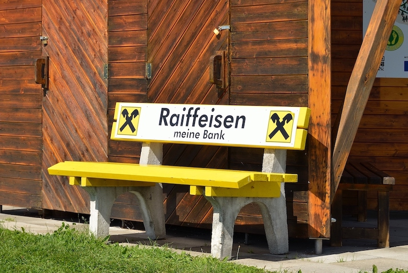

---
title:
- Hackergenossenschaft als Plattform chaosnahen Wirtschaftens 
- Der Countdown zählt runter und die Rakete hebt endlich Anfang 2021 ab.  
author:
- ajuvo, L3D + therojam
theme:
- focus
---

# Wer sind wir?

## im Vortrag

 [@ajuvo](https://chaos.social/@ajuvo)
 [@l3d(https://chaos.social/@l3d)]
 [@therojam](https://chaos.social/@therojam)

## rc3.World

in der Dezentrale (chaozone, Spaces @North) untere Etage

## Outerspace

[vebit.xyz](https://vebit.xyz)

---
 ## Video

	 [Lightning Talk von @ajuvo auf dem 34C3](https://media.ccc.de/v/34c3-9256-lightning_talks_day_2#t=2722)
---

--- 

# Table of Contents

- Informationen & Resourcen
- Was ist eine Genossenschaft?
- Unsere Idee - HackerGeno
- Wasserstand
- Q & A -- Eure Fragen 

---
# Informationen & Resourcen

	-   media.ccc.de
		-  [Votrag von @ajuvo auf den Datenspuren 2017](https://media.ccc.de/v/DS2017-8659-hacker_eg)
		-  [Lightning Talk von @ajuvo auf dem 34C3](https://media.ccc.de/v/34c3-9256-lightning_talks_day_2#t=2722)
    -  [Vortrag von @ajuvo + @therojam auf dem 35c3](https://media.ccc.de/v/35c3chaoswest-37-hacker-eg-genossenschaft-fr-chaosnahes-wirtschaften)i
    -  [Vortrag von @ajuvo + @l3d bei der PrivacyWeek 2020](https://media.ccc.de/v/pw20-341-die-hackergenossenschaft-als-plattform-chaosnahen-wirtschaftens)
    -  [Wie Gründe ich eine Genossenschaft vom rc3 2020](https://media.ccc.de/v/rc3-578923-wie_gruende_ich_eine_genossenschaft)
  - [Discourse für Mitglieder_innen](https://meta.vebit.xyz/) *
	- [@HackerGeno auf Mastodon](https://chaos.social/@HackerGeno)

---

# Was ist eine Genossenschaft? 

## Revolution im Kapitalismus

 -   Geschichte
 -   Personengesellschaft mit Kapitalkonstruktion
 -   Rechtsform
 -   GenG

---

# Wasserstand / Fahrplan
## wo sind wir
 
 - [x] vebit e.V. gründen ... fand Q1 2019 in Dresden
 - [x] 2xx (oder schon mehr...) Member im VEB IT e.V. werden ... wurde in Q4 2019 erreicht
 - [x] Workshops, Camps, remote Meetings und TeleBier... vieles mehr ... 2019 ... 2020
 - [x] passenden Genossenschaftsverband finden ... gefunden im Q3 2020
 - [x] Einsammlung von Zeichnungserklärungen für die Geno ... Stichtag war im Oktober 2020
 - [ ] Eintragung ins Genossenschaftsregister von Hamburg ... geplant fuer Januar/2021

---

# Danke 

Fuer eure Aufmerksamkeit

---

# Questioning & Answering 

- \#rc3geno - \#rc3chaoswest

### live 

